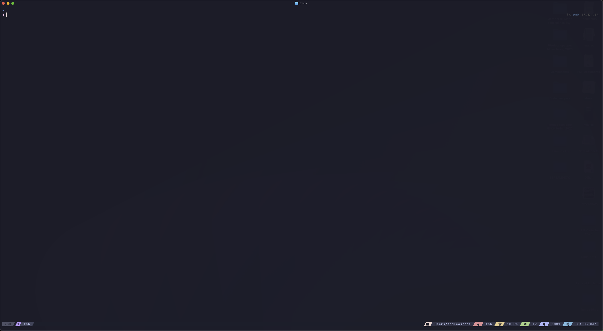
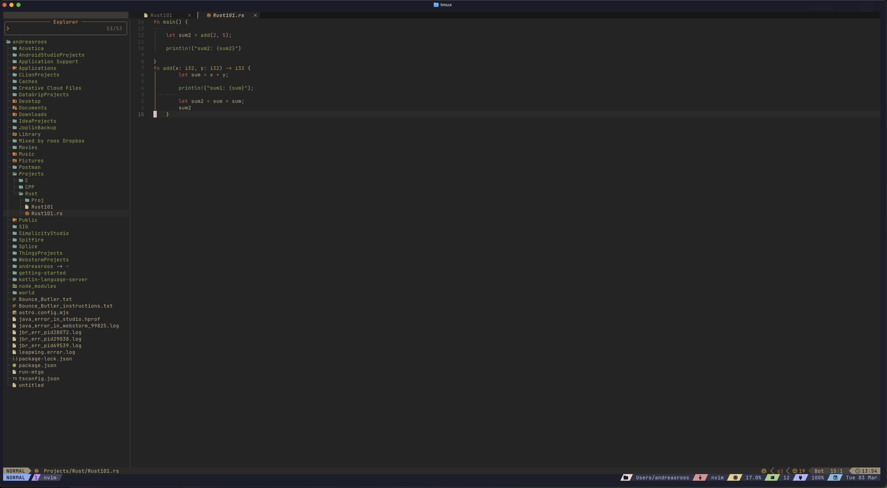
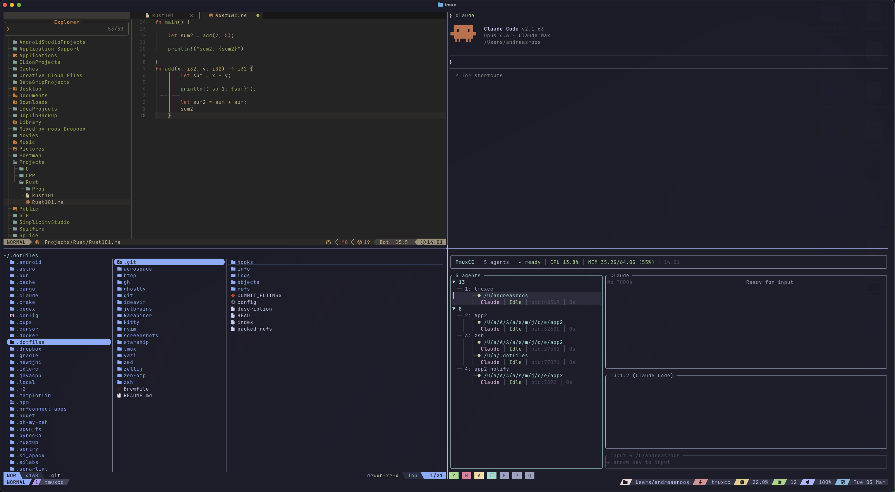

# dotfiles

Personal dotfiles managed with [GNU Stow](https://www.gnu.org/software/stow/) and [Homebrew Bundle](https://github.com/Homebrew/homebrew-bundle).

## Screenshots

### Ghostty + tmux + Catppuccin Macchiato


### Neovim


### AeroSpace tiling — Neovim, Claude, yazi, tmux


## Setup on a new Mac

```bash
# Install Homebrew
/bin/bash -c "$(curl -fsSL https://raw.githubusercontent.com/Homebrew/install/HEAD/install.sh)"

# Clone
git clone https://github.com/Gaurgle/dotfiles ~/.dotfiles
cd ~/.dotfiles

# Install all packages
brew bundle

# Symlink all configs
stow aerospace tmux zsh git nvim karabiner ghostty kitty starship yazi btop zellij zed zen-omp gh ideavim

# Install tmux plugins — open tmux, then prefix + I
```

## Stow packages

| Package | Config location |
|---------|----------------|
| aerospace | `~/.config/aerospace/aerospace.toml` |
| btop | `~/.config/btop/` |
| gh | `~/.config/gh/` |
| ghostty | `~/.config/ghostty/config` |
| git | `~/.gitconfig`, `~/.config/git/ignore` |
| ideavim | `~/.ideavimrc` |
| karabiner | `~/.config/karabiner/` |
| kitty | `~/.config/kitty/` |
| nvim | `~/.config/nvim/` |
| starship | `~/.config/starship/` |
| tmux | `~/.tmux.conf`, `~/.tmux/plugins/tpm` |
| yazi | `~/.config/yazi/` |
| zed | `~/.config/zed/` |
| zellij | `~/.config/zellij/` |
| zen-omp | `~/.config/zen-omp.toml` |
| zsh | `~/.zshrc`, `~/.zshenv`, `~/.zprofile` |

## Navigation layers

The setup has three layers of window/pane management stacked on top of each other. Each layer has its own modifier key and its own concept of "windows."

```
┌─────────────────────────────────────────────────────┐
│  AeroSpace (opt)         — manages macOS windows    │
│  ┌───────────────────┐  ┌───────────────────┐       │
│  │ Ghostty            │  │ Android Studio    │       │
│  │ ┌───────────────┐  │  │                   │       │
│  │ │ tmux (C-a)    │  │  │                   │       │
│  │ │ ┌─────┬─────┐ │  │  │                   │       │
│  │ │ │nvim │shell│ │  │  │                   │       │
│  │ │ │     │     │ │  │  │                   │       │
│  │ │ └─────┴─────┘ │  │  │                   │       │
│  │ └───────────────┘  │  │                   │       │
│  └───────────────────┘  └───────────────────┘       │
└─────────────────────────────────────────────────────┘
```

### Layer 1: AeroSpace — macOS windows (modifier: `opt`)

The outermost layer. Manages how macOS application windows are arranged on screen. Each workspace is a virtual desktop that can hold multiple app windows tiled side by side.

| Action | Bind |
|--------|------|
| Switch workspace | `opt+a/i/s/f/d` or `opt+0-9` |
| Focus next app window | `opt+h/j/k/l` |
| Move app window to workspace | `opt+shift+<key>` |
| Resize app window | `opt+-/=` |

**Example:** `opt+d` to go to the terminal workspace, then `opt+l` to focus the Ghostty window next to Android Studio.

### Layer 2: Ghostty — terminal tabs and splits (modifier: `cmd`)

Inside Ghostty, tabs and splits for running multiple terminal sessions without tmux.

| Action | Bind |
|--------|------|
| Switch tab | `cmd+1-9` |
| Split pane | `cmd+shift+d` |
| Move tab | `cmd+shift+8/9` |

### Layer 3: tmux — terminal panes and sessions (modifier: `C-a`)

Inside a Ghostty tab, tmux manages panes (splits within one terminal) and windows (tabs within tmux). Sessions persist across disconnects.

| Action | Bind |
|--------|------|
| Navigate panes | `C-h/j/k/l` (seamless with nvim) |
| New window | `C-a c` |
| Split horizontal | `C-a "` |
| Split vertical | `C-a %` |
| Next/prev window | `C-a n` / `C-a p` |
| Detach session | `C-a d` |

### How they interact

- **AeroSpace** doesn't know about tmux panes — it sees Ghostty as one window
- **tmux** pane navigation (`C-h/j/k/l`) works seamlessly with nvim via vim-tmux-navigator
- **Ghostty** splits are independent of tmux — use one or the other, not both
- To move a terminal to another AeroSpace workspace: it's the whole Ghostty window that moves, including all tmux panes inside it

### Quick mental model

| I want to... | Layer | Bind |
|--------------|-------|------|
| Switch from browser to terminal | AeroSpace | `opt+d` |
| Switch between two tiled apps | AeroSpace | `opt+h/l` |
| Jump between tmux panes | tmux | `C-h/j/k/l` |
| Open a new terminal tab | Ghostty | `cmd+t` |
| Open a new tmux pane | tmux | `C-a %` or `C-a "` |
| Move an app to another workspace | AeroSpace | `opt+shift+<key>` |

## Modifier keys

Each modifier has a dedicated role — no conflicts.

| Key | Role |
|-----|------|
| Caps Lock | Hyper key (Ctrl+Shift+Alt+Cmd) via Karabiner — tap for Escape |
| Ctrl | tmux prefix (`C-a`) |
| Cmd | macOS standard shortcuts |
| Option (Alt) | AeroSpace window manager |

## Keybindings

### Karabiner

- **Caps Lock** (hold) → Hyper key (Ctrl+Shift+Alt+Cmd) — app launching and global shortcuts via Raycast
- **Caps Lock** (tap) → Escape
- External keyboard: grave/tilde and non-US backslash swapped (ANSI layout fix)

### Raycast (Hyper key app shortcuts)

| Hyper+ | App |
|--------|-----|
| A | Android Studio |
| B | Bruno |
| C | ChatGPT |
| D | Ghostty |
| F | Brave Browser |
| I | IntelliJ IDEA |
| M | Mail |
| N | Notes |
| O | Finder |
| R | Calculator |
| S | Sublime Text |
| V | Claude |
| X | Sublime Merge |
| Z | Zed |
| 2 | Messages |
| [ | DataGrip |
| ; | VS Code |
| ' | WebStorm |

### AeroSpace (tiling window manager)

All bindings use **Option (Alt)** as the modifier.

**Focus & move (vim-style):**

| Bind | Action |
|------|--------|
| `opt+h/j/k/l` | Focus left/down/up/right |
| `opt+shift+h/j/k/l` | Move window left/down/up/right |
| `opt+cmd+h/j/k/l` | Join window into container |

**Workspaces (mirrors Raycast hyper keys):**

| Bind | Workspace | App context |
|------|-----------|-------------|
| `opt+a` | a | Android Studio |
| `opt+i` | i | IntelliJ IDEA |
| `opt+s` | s | Sublime Text |
| `opt+f` | f | Browser (Brave) |
| `opt+d` | d | Ghostty (terminal) |
| `opt+1-9` | 1-9 | General purpose |
| `opt+shift+<key>` | — | Move window to that workspace |
| `opt+tab` | — | Toggle previous workspace |
| `opt+shift+tab` | — | Move workspace to next monitor |

**Window management:**

| Bind | Action |
|------|--------|
| `opt+w` | Close window |
| `opt+enter` | New Ghostty terminal |
| `opt+/` | Toggle tile horizontal/vertical |
| `opt+,` | Toggle accordion mode |
| `opt+-/=` | Resize shrink/grow |

**Service mode** (`opt+shift+;` to enter):

| Key | Action |
|-----|--------|
| `r` | Reset workspace layout |
| `f` | Toggle floating/tiling |
| `up/down` | Volume up/down |
| `esc` | Exit mode |

### tmux

Prefix: **Ctrl+a** (`C-b` also works)

| Bind | Action |
|------|--------|
| `C-h/j/k/l` | Navigate panes (vim-tmux-navigator — seamless with nvim) |
| `prefix+I` | Install plugins via tpm |
| `prefix+r` | Reload config |

Mouse enabled. Vi mode for copy.

**Plugins:** sensible, vim-tmux-navigator, resurrect, yank, fzf, battery, cpu, online-status, catppuccin (macchiato)

**Status bar:** git branch, directory, app name, cpu, session, battery, date, online status — all themed with Catppuccin Macchiato.

### Ghostty

| Bind | Action |
|------|--------|
| `cmd+1-9` | Switch to tab |
| `cmd+shift+d` | Split pane down |
| `cmd+shift+9/8` | Move tab forward/back |
| `opt+backspace` | Delete word |

Catppuccin Mocha theme. JetBrainsMono Nerd Font 13pt. Near-opaque background (0.99).

### IdeaVim (IntelliJ / Android Studio)

Plugins: vim-highlightedyank, vim-commentary, nerdtree

| Bind | Action |
|------|--------|
| `C-h` | Open project explorer |
| `C-l` | Focus editor |
| `l` (NERDTree) | Activate/open node |
| `h` (NERDTree) | Jump to parent |
| `Q` | Format selection (gq) |

### IntelliJ custom keymap ("macOS copy")

Based on Mac OS X 10.5+ with custom overrides.

**Hyper key (Caps Lock) shortcuts:**

| Bind | Action |
|------|--------|
| `hyper+0` | AI Assistant tool window |
| `hyper+6` | Gradle tool window |
| `hyper+7` | Maven tool window |
| `hyper+8` | Database tool window |
| `hyper+9` | Version Control tool window |
| `hyper++` | Run tool window |
| `hyper+j j` | AI inline editor |
| `hyper+w` | Line comment |
| `hyper+backtick` | Terminal |

**Cmd shortcuts:**

| Bind | Action |
|------|--------|
| `cmd+l` | Reformat code |
| `cmd+shift+w` | Block comment |
| `cmd+shift+n` | New class |
| `cmd+shift+p` | New directory |
| `cmd+shift+alt+n` | New scratch file |
| `cmd+[/]` | Navigate back/forward |
| `cmd+alt+up/down` | Code block start/end |
| `cmd+up/down` | Page top/bottom |
| `ctrl+,/.` | Decrease/increase font size |

### Shell (zsh)

**Aliases:**

| Alias | Command |
|-------|---------|
| `lz` | `eza --icons --group-directories-first --grid` |
| `gitconf` | View `.gitconfig` with syntax highlighting |

**Git aliases (.gitconfig):**

| Alias | Command |
|-------|---------|
| `git st` | `status` |
| `git a` | `add .` |
| `git cm "msg"` | `commit -m "msg"` |
| `git gac "msg"` | `add . && commit -m "msg"` |
| `git amend` | `commit --amend --no-edit` |
| `git lg` | Pretty log graph |
| `git p` | `push` |
| `git pl` | `pull` |
| `git co` | `checkout` |
| `git nb` | `checkout -b` (new branch) |
| `git pnb` | Push and set upstream for current branch |
| `git unstage` | `reset HEAD --` |
| `git last` | Show last commit |
| `git week` | Weekly log with dates |

**Tools:**
- **zoxide** with pwd hook — `z <fuzzy>` jumps to frequently used dirs, learns from `cd`
- **oh-my-posh** with zen theme for prompt
- **zsh-autosuggestions** and **zsh-syntax-highlighting**
- **eza** as `ls` replacement (via `lz` alias)

## How stow works

All config files live in this repo and get symlinked to `~` via `stow`. Any edits are automatically tracked by git.

```bash
stow nvim        # Create symlinks
stow -D nvim     # Remove symlinks (unstow)
stow -R nvim     # Refresh symlinks (restow)
```
